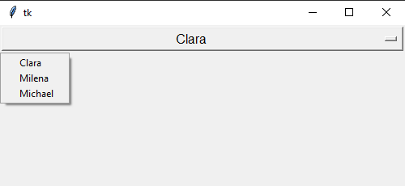
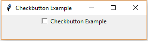

# Tkinter Examples and Screenshots

## Tkinter Button

### Source code example

```python
import tkinter as tk

window = tk.Tk()
window.title("Button Example")
window.geometry("280x50")

btn = tk.Button(window, text="A button", fg="red", bg="yellow")
btn.pack()

window.mainloop()

```

### Screenshot


## Tkinter Menu and Menubutton

### Source code example

### Screenshot


## Tkinter Scale

### Source code example

### Screenshot


## Tkinter OptionMenu


### Source code example
```python
import tkinter as tk

OptionList = [
"Clara",
"Milena",
"Michael",
]

app = tk.Tk()

app.geometry('500x200')

variable = tk.StringVar(app)
variable.set(OptionList[0])

opt = tk.OptionMenu(app, variable, *OptionList)
opt.config(width=90, font=('Helvetica', 12))
opt.pack()

app.mainloop()
```
### Screenshot



## Tkinter Dialogs

### Sourcecode Example

### Screenshot


## Tkinter Checkbutton

### Sourcecode Example

```python

from tkinter import * 

window = Tk()
window.title("Checkbutton Example")
window.geometry("300x50")

CheckBtn = Checkbutton(window , text = "Checkbutton Example")
CheckBtn.pack()
window .mainloop()

```

### Screenshot




## Tkinter LabelFrame and RadioButton

### Source code example

### Screenshot


## Tkinter PanedWindow

### Source code example

### Screenshot


## Tkinter Canvas

### Source code example

### Screenshot


## Tkinter Listbox and Scrollbar

### Source code example

### Screenshot


# Exercise
 - Install git on your machine
 - Create a fork of this repository inside github
 - Clone your fork locally (`git clone`)
 - Add a **source code example** and a **screenshot** to one of the topics inside the `README.md` file
 - Commit your changes and add a meaningful commit message (`git commit`)
 - Push your changes to your fork (`git push`)
 - Create a pull request for your changes inside github
 
## Help
 - [Git Download](https://git-scm.com/downloads)
 - [Project forking workflow](https://guides.github.com/activities/forking/)

