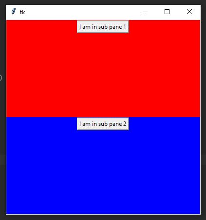

# Tkinter Examples and Screenshots

## Tkinter Button

### Source code example

```python
import tkinter as tk

window = tk.Tk()
window.title("Button Example")
window.geometry("280x50")

btn = tk.Button(window, text="A button", fg="red", bg="yellow")
btn.pack()

window.mainloop()

```

### Screenshot


## Tkinter Menu and Menubutton

### Source code example

### Screenshot


## Tkinter Scale

### Source code example

### Screenshot


## Tkinter OptionMenu

### Source code example

### Screenshot


## Tkinter Dialogs

### Sourcecode Example

### Screenshot


## Tkinter Checkbutton

### Sourcecode Example

### Screenshot


## Tkinter LabelFrame and RadioButton

### Source code example

### Screenshot


## Tkinter PanedWindow

### Source code example

```python
import tkinter as tk

window = tk.Tk()
window.geometry("400x400")

main_pane = tk.PanedWindow(window, orient = "vertical")
main_pane.pack(fill = tk.BOTH, expand = True)

sub_1 = tk.PanedWindow(main_pane)
sub_1["bg"] = "red"
sub_1.pack(fill = tk.BOTH, expand = True)

button1 = tk.Button(sub_1, text="I am in sub pane 1")
button1.pack()

sub_2 = tk.PanedWindow(main_pane)
sub_2["bg"] = "blue"
sub_2.pack(fill = tk.BOTH, expand = True)

button2 = tk.Button(sub_2, text="I am in sub pane 2")
button2.pack()

window.mainloop()
```

### Screenshot


## Tkinter Canvas

### Source code example

### Screenshot


## Tkinter Listbox and Scrollbar

### Source code example

### Screenshot


# Exercise
 - Install git on your machine
 - Create a fork of this repository inside github
 - Clone your fork locally (`git clone`)
 - Add a **source code example** and a **screenshot** to one of the topics inside the `README.md` file
 - Commit your changes and add a meaningful commit message (`git commit`)
 - Push your changes to your fork (`git push`)
 - Create a pull request for your changes inside github
 
## Help
 - [Git Download](https://git-scm.com/downloads)
 - [Project forking workflow](https://guides.github.com/activities/forking/)

